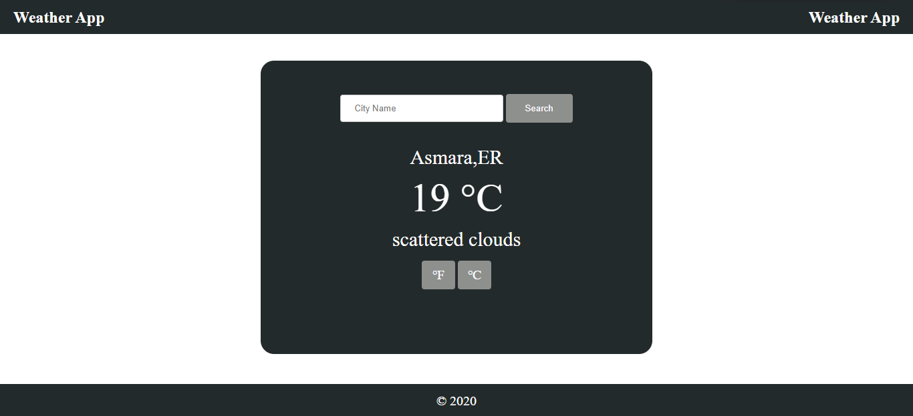

# WEATHER-APP
 A weather forecast site using the weather API, built using Javascript and HTML/CSS

## Built With

- JavaScript
- Webpack
- HTML/CSS

[Live Demo Link](https://raw.githack.com/Samitti/WEATHER-APP/homepage/dist/index.html)

## Getting Started
To get a copy up and running follow these simple example steps:-
- Clone `https://github.com/Samitti/WEATHER-APP.git` to your local machine.
- Run `npm install` to install dependancies.
- cd into the WEATHER-APP directory and navigate into the dist directory.
- Run index.html in a browser.

To make WEATHER-APP directory in you favorite editor.
- Navigate to src folder to make any changes.
- To preview changes live, use npm run dev from your terminal then run index.hmtl in the browser.
- When you finish your changes, run npm run build to create the production files to the dist folder.

## Author

👤 **Samuel Teweldebrhan Ghebremeskel**

- Github: [@githubhandle](https://github.com/Samitti)
- Twitter: [@twitterhandle](https://twitter.com/Samuel63734232)
- Linkedin: [linkedin](https://www.linkedin.com/in/samuel-ghebremeskel-29685811a/)

## 🤝 Contributing

Contributions, issues and feature requests are welcome!

Feel free to check the [issues page](https://github.com/Samitti/WEATHER-APP/issues).

## Show your support

Give a ⭐️ if you like this project!

